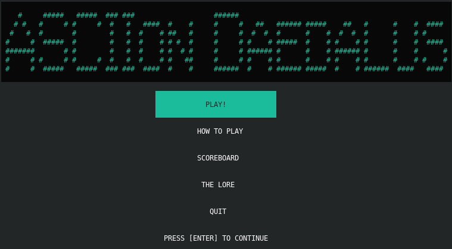
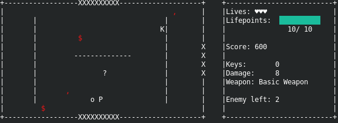

# Asciion Daedalus
The game is implemented in C++ and built with gcc/make toolchain.
\


<div align="center">
 <table style="width:100%">
  <tr>
    <td></td>
    <td></td>
  </tr>
</table>
 </div>
## Synopsis
The evil king Asciion for some unknown reasons, captured and imprisoned you in his dangerous labyrinth: the Daedalus.
According to the kingdom bards, the king's hobby is to recreate wild animals in an ascii-art version: 
the Deadalus contains all his works. 
To keep the kindom safe from these strange creatures, the labyinth was made to be *completely* unescapable.
Your end is near, but since we're here you'll want to at least become the strongest in the Deadalus, right?
Then take your weapons and make *his* labyrinth **your** labyrinth!
## Dependencies
The game depends on the C++ standard library, along with the C standard library and `ncurses` library which version, at the time of writing, is `6.1`.
The program work on all `ncurses` version greater or equal than `6.0` without any problem, it should work on previous version too (due to basicness of the functions used), but this is not actually tested.

## Building, Running and Testing
`makefile` compiles the source files automatically and (re)build only the files that have changed.

/

Compiling and linking with:
```sh
$ make
```
Run the game with:
```sh
$ make launch
```
To reset the scoreboard:
```sh
$ make scoreboard
```
## Game Controls
For moving and/or dodge enemy bullets you can use `[w] [a] [s] [d]` keys corresponding to the direction you want.
\
Shooting in a direction is performed by respective arrow keys.
\
If you're able to open a door in-game, it can be achieved with `[r]` in front of it.
## Credits
Made by Patrick Alfieri. 
